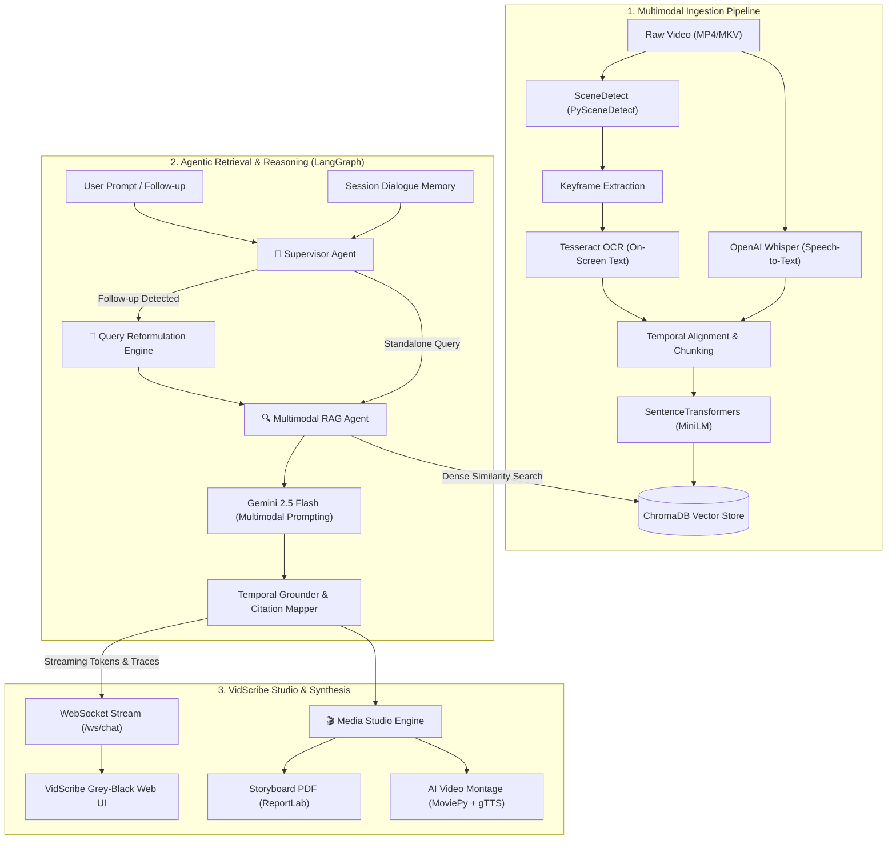

# VidScribe 🎬
### Agentic Multimodal Video Intelligence & Synthesis Studio

[](https://www.python.org/)
[](https://fastapi.tiangolo.com/)
[](https://langchain-ai.github.io/langgraph/)
[](https://deepmind.google/technologies/gemini/)
[](https://www.trychroma.com/)
[](https://www.docker.com/)
[](https://opensource.org/licenses/MIT)

**VidScribe** is an autonomous multimodal video intelligence platform that bridges video understanding, temporal retrieval-augmented generation (VideoRAG), and generative media synthesis. Built with a LangGraph multi-agent architecture and Google Gemini multimodal reasoning, VidScribe indexes long-form video across speech, visuals, and on-screen text to provide conversational question answering with exact sub-second timestamp citations.

---

## 🌟 Key Highlights

- **🧠 Multi-Agent Orchestrator**: Modular LangGraph supervisor coordinating specialized agents for query routing, ChromaDB vector retrieval, Whisper transcription, and visual OCR grounding.
- **💬 Short-Term Conversational Memory**: Full multi-turn dialogue memory with autonomous query reformulation — seamlessly resolving pronouns and context references across follow-up queries.
- **⏱️ Sub-Second Grounded Citations**: Interactive timestamp chips (`▶ 00:06.539 - 00:12.345`) embedded directly in answers that seek the synchronized HTML5 player in one click.
- **🎨 Precision Grey-Black Studio UI**: Modern 2-panel workstation featuring a compact video monitor dock, dominant intelligence canvas, and an expandable Multi-Agent Cockpit displaying live thought traces.
- **📄 Autonomous Media Studio**: One-click generation of exportable Storyboard PDFs (with keyframe grids & timestamps) and compiled AI Video Highlight montages with synthesized neural voiceover.
- **🐳 Production Docker Containerization**: Complete multi-stage Docker environment with pre-installed `ffmpeg`, `tesseract-ocr`, and pre-cached ML model weights.

---

## 🏗️ Architecture & Pipeline Flow

VidScribe decouples video ingestion, hybrid semantic retrieval, and agentic response synthesis:



---

## 💻 Tech Stack

| Domain | Technology / Library | Purpose |
| :--- | :--- | :--- |
| **Agentic Framework** | `LangGraph` & `LangChain 0.3+` | State graph management, supervisor routing & cyclical agent execution |
| **Foundation LLM** | `Google Gemini 2.5 Flash` | Multimodal reasoning, keyframe synthesis & query reformulation |
| **Speech-to-Text (ASR)** | `OpenAI Whisper` | Automatic audio transcription and word-level timestamp synchronization |
| **Computer Vision & OCR** | `PySceneDetect`, `OpenCV`, `Pillow`, `PyTesseract` | Dynamic scene boundary cut detection, keyframe extraction & spatial text recognition |
| **Vector Database** | `ChromaDB` & `SentenceTransformers` | Persistent vector store with dense cosine embeddings (`all-MiniLM-L6-v2`) |
| **Creative Synthesis** | `MoviePy`, `gTTS`, `ReportLab` | Video clip concatenation, neural text-to-speech audio, and PDF compilation |
| **Backend & Streaming** | `FastAPI`, `Uvicorn`, `WebSockets` | Async REST endpoints and bi-directional real-time token/trace streaming |
| **Frontend UI** | Vanilla ES6+ JS, HTML5, Custom CSS | High-performance Grey-Black cyber studio, zero-dependency modern SPA |
| **Containerization** | `Docker` & `Docker Compose` | Reproducible deployment bundling native `ffmpeg` & `tesseract` drivers |

---

## ⚡ Engineering Challenges & Design Decisions

### 1. Multi-Turn Context without Vector Drift
- **Problem**: When a user asks a follow-up like *"What happens after that?"*, querying vector databases directly with conversational pronouns yields irrelevant semantic matches.
- **Solution**: The Supervisor inspects dialogue history and reformulates contextual follow-ups into standalone keyword search queries before querying ChromaDB, preserving conversational continuity while maintaining vector precision.

### 2. Temporal Multimodal Alignment
- **Problem**: Audio transcripts and visual scene cuts frequently drift apart temporally.
- **Solution**: VidScribe indexes keyframes by their exact middle timestamp and aligns overlapping Whisper speech segments within bounded scene windows, generating unified multimodal chunks (`start_time`, `end_time`, `scene_index`, `ocr_text`, `speech_text`).

### 3. Native Binary Portability in Docker
- **Problem**: Deploying vision systems often fails due to missing system-level `ffmpeg` codecs and `libGL` dependencies.
- **Solution**: The Docker environment packages Debian-tested `ffmpeg` and `tesseract-ocr` binaries with pre-warmed ML model caches to eliminate cold-start runtime downloads.

---

## 🚀 Quick Start

### Option A: Run with Docker Compose (Recommended)

1. **Clone the repository**:
   ```bash
   git clone https://github.com/your-username/vidscribe.git
   cd vidscribe
   ```

2. **Configure your API Key**:
   ```bash
   cp .env.example .env
   # Add your Google Gemini API key to .env:
   # GEMINI_API_KEY=your_key_here
   ```

3. **Build and launch**:
   ```bash
   docker compose up --build -d
   ```
   Open **http://localhost:8000** in your browser.

---

### Option B: Local Setup (Python 3.11+)

1. **Prerequisites**: Ensure `ffmpeg` and `tesseract` are installed on your host system.
2. **Setup virtual environment**:
   ```bash
   python -m venv env
   # Activate:
   # Windows:
   .\env\Scripts\activate
   # Linux/macOS:
   source env/bin/activate
   ```
3. **Install dependencies**:
   ```bash
   pip install -r requirements.txt
   ```
4. **Configure environment**:
   ```bash
   cp .env.example .env
   # Set GEMINI_API_KEY in .env
   ```
5. **Start application**:
   ```bash
   python run.py
   ```
   Navigate to **http://127.0.0.1:8000**.

---

## 📁 Repository Structure

```
vidscribe/
├── agents/             # LangGraph agent nodes (Supervisor, Multimodal RAG)
├── backend/            # FastAPI app, REST routing, WebSockets & session memory
├── core/               # Video, Audio, Vision, Vector DB & Media synthesis engines
├── frontend/           # Grey-Black studio single-page web UI (HTML, CSS, JS)
│   ├── css/style.css   # Precision design tokens & component stylesheets
│   └── js/             # Modular controllers (player, chat, app, api)
├── schemas/            # Pydantic schemas for RAG requests, segments & metadata
├── data/               # Raw uploaded videos (mounted volume)
├── processed/          # Extracted keyframes & persistent ChromaDB storage
├── summaries/          # Output directory for Storyboard PDFs & Summary videos
├── Dockerfile          # Multi-stage production container specification
├── docker-compose.yml  # Container service definitions & persistent volumes
├── requirements.txt    # Python package dependencies
├── config.py           # Centralized configuration management
└── run.py              # Application entrypoint launcher
```

---

## 📄 License

This project is licensed under the **MIT License** — feel free to use and adapt it for research, personal, or commercial projects.